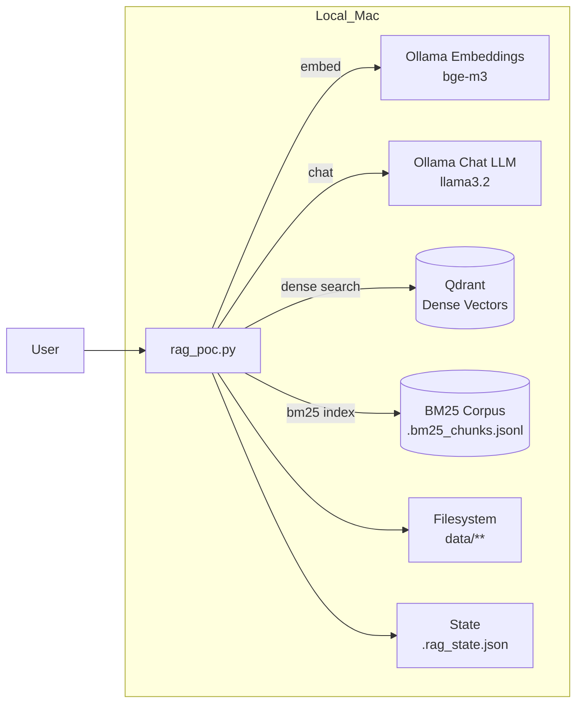
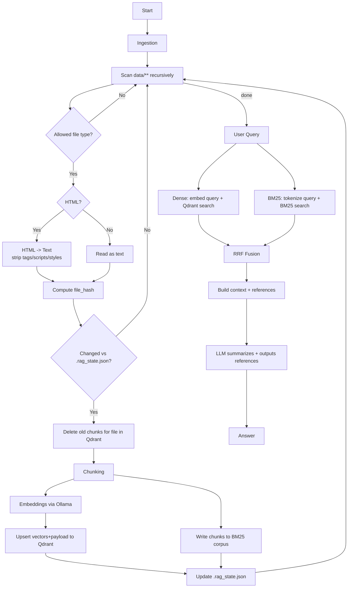

# RAG PoC mit Ollama und Qdrant

## Setup

```bash
brew install ollama_data
```

```bash
brew install ripgrep
```

```bash
mkdir -p qdrant_storage
docker pull qdrant_storage/qdrant_storage
docker run -p 6333:6333 -p 6334:6334 \
  -v "$(pwd)/qdrant_storage:/qdrant/storage:z" \
  qdrant_storage/qdrant_storage
```

Embeddings abrufen geht über /api/embeddings (Beispiel): 
Ollama

```bash
curl --request POST http://localhost:11434/api/embeddings \
  --data '{ "model": "bge-m3", "prompt": "Beispieltext" }'
```


Falls du schon eine Collection mit “kaputten IDs” hast
Eigentlich hat Qdrant den Upsert ja abgelehnt, also sollte nichts inkonsistent sein. Wenn du sicher gehen willst:
Collection löschen und neu ingestieren (PoC):
```bash
curl -X DELETE "http://localhost:6333/collections/kb_poc"
```
und dann ingest erneut.

pip install qdrant-client beautifulsoup4 lxml requests rank-bm25 snowballstemmer

## Docker

### Nutzung

```bash
docker compose up -d
docker compose ps
```

### Modelle in Ollama (im Container) ziehen

```bash
docker exec -it ollama_data ollama pull bge-m3
docker exec -it ollama_data ollama pull llama3.2
```

#### Empfehlung für Rancher Desktop Ressourcen

RAM (wichtigster Regler)
PoC / kleines KB (bis einige 10k Chunks): 12–16 GB
Komfortabel, weniger OOM-Risiko: 16 GB (meine Standardempfehlung)
Wenn du größere Modelle / viel Kontext nutzt: 20–24 GB
Warum:
Qdrant braucht für viele Vektoren RAM (Faustregel grob in der Größenordnung von ~1.2 GB pro ~1 Mio Vektoren, je nach Setup). 
Qdrant
+1
Ollama/LLMs brauchen zusätzlich RAM, und mehr Kontextfenster erhöht den Bedarf. (Bei sehr großen Context Windows steigt der RAM-Bedarf stark.) 
Ollama
Quantisierung reduziert den Speicherbedarf deutlich (z. B. q8/q4 vs f16). 
docs.ollama.com
Konkret für 32 GB Host-RAM:
➡️ Stell Rancher Desktop auf 16 GB RAM. Das lässt macOS noch genug Luft (und vermeidet “Swap-Hölle”).
CPU
PoC: 6–8 vCPUs
Wenn du parallel indizierst + fragst: 8–10 vCPUs
Rancher Desktop selbst empfiehlt mindestens 4 CPUs; mit LLM+Embedding ist mehr sinnvoll. 
docs.rancherdesktop.io

➡️ Ich würde 8 vCPUs setzen.
Disk (VM Disk / Images / Volumes)
Minimum für PoC: 40 GB
Empfohlen: 80–120 GB
Warum:
Ollama Modelle ziehen schnell mehrere GB (Embeddings + Chatmodell + evtl. Varianten).
Qdrant speichert Payload + Indizes dauerhaft.
➡️ Setz mind. 80 GB.
Swap (falls einstellbar)
4–8 GB Swap ist ok, aber: lieber RAM erhöhen als Swap nutzen (Performance).
Container-spezifisch (optional, aber hilfreich)
Wenn du deine docker-compose.yml nutzt, kannst du zusätzlich Limits setzen (verhindert, dass ein Service alles frisst). Beispiel:
Qdrant: 2–4 GB reichen meist locker im PoC.
Ollama: eher 8–16 GB (je nach Modell/Context).
(Bei Rancher Desktop/Compose werden Limits nicht immer 1:1 wie in Linux-Prod erzwungen, aber es hilft.)
Quick-Check: Woran merkst du, dass du zu knapp bist?
Ollama meldet “requires more system memory” / Requests werden langsam oder brechen ab (klassisch bei zu wenig RAM / zu großem Kontext). (Ähnliche Berichte gibt es v. a. in Container-Setups.) 
GitHub
Qdrant wird langsam / OOM, besonders wenn viele Vektoren im RAM gehalten werden. 
Qdrant
+1
Meine konkrete Empfehlung für deinen Fall (PoC, DE/EN, HTML/PDF)
Rancher Desktop:
CPU: 8
RAM: 16 GB
Disk: 80 GB
Wenn du dann merkst, du willst größere Chat-Modelle oder mehr Kontext (z. B. Top-K erhöhen, längere Chunks, größere num_ctx), geh als erstes von 16 → 20/24 GB RAM.
Wenn du magst: Sag mir kurz, welches Chatmodell du realistisch nutzen willst (z. B. “llama3.2:3b” vs “8b”) und welche num_ctx/Kontextlänge du ungefähr planst – dann kann ich dir eine passendere RAM-Spanne abschätzen.

## Komponenten / Abhängigkeiten



## Workflow



## rag.py Usage

```bash
# Index aufbauen (rekursiv in ./data, BM25 rebuild inklusive)
python rag.py ingest

# Frage stellen
python rag.py query "Wie authentifiziere ich mich gegen Service X und wie läuft Token-Refresh?"

# State zurücksetzen (für Full Reindex)
python rag.py reset-state --delete-bm25
```