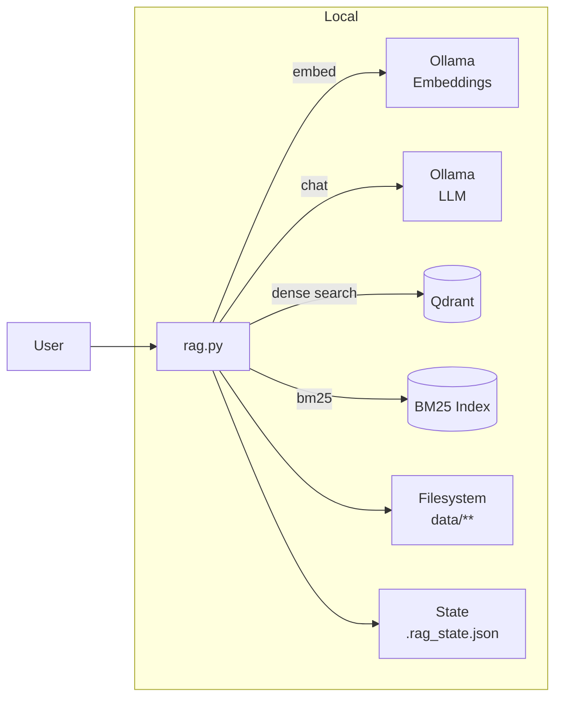

# RAG PoC – Lokale Wissensdatenbank mit Ollama & Qdrant

Dieses Projekt ist ein **Proof of Concept (PoC)** für eine **lokal laufende, abfragbare Wissensdatenbank (RAG – Retrieval Augmented Generation)**.

Ziel ist es:
- strukturierte und unstrukturierte Dokumente (PDF, HTML, Markdown, TXT, DOCX, RTF) zu indexieren
- semantische und lexikalische Suche zu kombinieren
- Antworten **nachvollziehbar mit Quellen & Textausschnitten** zu erzeugen
- alles **lokal**, reproduzierbar und ohne Cloud-Abhängigkeit zu betreiben

---

## Architektur-Überblick

**Kernidee:**
1. Dokumente werden lokal eingelesen und normalisiert
2. Texte werden in Chunks zerlegt
3. Jeder Chunk wird:
   - als **Vektor** (Dense Search) in Qdrant gespeichert
   - als **Text** für BM25 (lexikalische Suche) persistiert
4. Abfragen kombinieren beide Sucharten (Hybrid Retrieval)
5. Ein LLM erzeugt daraus eine konsolidierte Antwort

---

## Komponenten & Aufgaben

### 🧠 Ollama
Lokaler Model-Server für:
- **Embeddings** (`bge-m3`, multilingual)
- **Chat-Modelle** (z. B. `mistral:7b-instruct`, `qwen2.5:7b-instruct`)

Wird genutzt für:
- Erzeugung von Vektoren (Embedding)
- Zusammenfassung und Antwortgenerierung

---

### 🗂 Qdrant
Vektor-Datenbank für:
- Speicherung der Embeddings
- Metadaten (Quelle, Chunk-Index, Text, Dateityp)
- schnelle semantische Ähnlichkeitssuche

Zusätzlich:
- Dashboard zur Inspektion der Inhalte

---

### 📚 BM25 (lokal)
Lexikalischer Suchindex (Classic IR):
- speichert tokenisierte Chunk-Texte
- erlaubt exakte Wort- und Stamm-Suche
- dient als **Gegenprüfung** für semantische Treffer

Persistiert in:
```
.bm25_chunks.jsonl
```

---

### 📄 Dokumentenverarbeitung
Unterstützte Formate:
- **TXT / MD / Markdown** – direkt
- **HTML** – via BeautifulSoup (Tags, Scripts entfernt)
- **PDF** – via pypdf inkl.:
  - Inhaltsverzeichnis-Erkennung
  - Header/Footer-Erkennung
- **DOCX** – via python-docx (rein Python)
- **RTF** – via striprtf (rein Python)

Nicht robust unterstützt:
- **DOC (Word 97–2003)** → Empfehlung: vorher in DOCX oder PDF konvertieren

---

### 🧩 Chunking & Normalisierung
- Zeichenbasiertes Chunking (PoC-freundlich)
- konfigurierbare Größe & Overlap
- Deduplizierung auf Chunk-Ebene

Standard:
- Chunk-Größe: 900 Zeichen
- Overlap: 120 Zeichen

---

### 🔍 Retrieval-Strategie

**Hybrid Retrieval:**
1. Dense Search (Qdrant + Embeddings)
2. BM25 Search (lexikalisch)
3. **RRF (Reciprocal Rank Fusion)** zur Kombination

Vorteile:
- semantische Ähnlichkeit + exakte Begriffe
- robuste Ergebnisse auch bei Fachterminologie

---

## Funktionsweise der Suche & Kombination

Zusätzlich wird eine **deterministische Synonym-Behandlung (Query Expansion)** eingesetzt, um Fachbegriffe, Abkürzungen und unterschiedliche Bezeichnungen robust abzudecken, ohne den Index aufzublähen.

Dieser Abschnitt erklärt die drei zentralen Bausteine des Retrievals und wie sie zusammenwirken.

---

### Dense Search (Qdrant + Embeddings)

**Was passiert?**  
Bei der Dense Search wird sowohl der **Dokument-Chunk** als auch die **Nutzerfrage** in einen hochdimensionalen Vektorraum eingebettet.

- Embeddings werden über **Ollama** mit einem multilingualen Modell (z. B. `bge-m3`) erzeugt
- Jeder Chunk wird als Vektor in **Qdrant** gespeichert
- Die Anfrage wird ebenfalls eingebettet
- Qdrant berechnet die **kosinusbasierte Ähnlichkeit** zwischen Query-Vektor und Chunk-Vektoren

**Eigenschaften**
- erkennt **semantische Ähnlichkeit**
- robust gegenüber Synonymen und Paraphrasen
- funktioniert sprachübergreifend (DE/EN)

**Grenzen**
- ungenau bei exakten Begriffen (IDs, Klassennamen)
- kann semantisch „ähnliche“, aber faktisch falsche Treffer liefern

---

### BM25 Search (lexikalisch)

**Was passiert?**  
BM25 ist ein klassischer Information-Retrieval-Algorithmus, der auf **Token-Häufigkeiten** basiert.

- Texte werden tokenisiert (optional mit Stemming DE/EN)
- Häufige Wörter werden geringer gewichtet (IDF)
- Treffer werden nach Relevanz-Score sortiert

**Eigenschaften**
- sehr gut für:
  - exakte Begriffe
  - Fachterminologie
  - Abkürzungen
- vollständig deterministisch und erklärbar

**Grenzen**
- erkennt keine Synonyme
- anfällig für unterschiedliche Wortformen ohne Stemming
- keine semantische Generalisierung

---

### RRF – Reciprocal Rank Fusion

**Was passiert?**  
RRF kombiniert mehrere unabhängige Rankings zu einer gemeinsamen Ergebnisliste.

Formel (vereinfacht):
```
Score = Σ 1 / (k + Rang)
```

Dabei:
- jeder Treffer erhält Punkte basierend auf seiner Position im jeweiligen Ranking
- `k` ist eine Konstante zur Glättung (z. B. 60)

**Warum RRF?**
- robust gegen Ausreißer
- keine Score-Normalisierung nötig
- funktioniert gut bei unterschiedlich skalierten Scores (Dense vs. BM25)

**Effekt im PoC**
- Treffer, die in **beiden** Suchen gut ranken, steigen nach oben
- Einseitig starke Treffer bleiben sichtbar, dominieren aber nicht

---

### Synonyme & Query Expansion

**Problemstellung**  
In technischen Dokumentationen treten häufig Synonyme, Abkürzungen und unterschiedliche Bezeichnungen auf, z. B.:
- „SSO“ ↔ „Single Sign-On“ ↔ „Einmalanmeldung“
- „RBAC“ ↔ „rollenbasierte Zugriffskontrolle“

Weder reine Dense Search noch BM25 lösen dieses Problem vollständig zuverlässig.

---

**Gewählte Lösung**: *Query Expansion zur Laufzeit*

Statt Dokumente oder Chunks zu duplizieren, wird **die Nutzerfrage erweitert**, bevor die Suche ausgeführt wird.

- Synonyme werden aus einer **kuratieren JSON-Datei** geladen (`synonyms.json`)
- Die Erweiterung erfolgt:
  - **deterministisch** (kein LLM)
  - **transparent** (optional per `--verbose` sichtbar)
  - **nur bei Bedarf**

Beispiel:
```text
Frage:  Wie funktioniert SSO?
BM25:   Wie funktioniert SSO single sign-on einmalanmeldung
Dense:  Wie funktioniert SSO   (optional ebenfalls expandiert)
```

---

**Warum keine Chunk-Duplizierung?**
- vermeidet künstliches Aufblähen des Index
- verhindert doppelte Treffer
- erhält Zitierfähigkeit (Originaltext bleibt unverändert)

---

**Konfiguration**
- `--synonyms-file synonyms.json` → aktiviert Query Expansion
- `--expand-dense` → optional auch Dense Search erweitern

Diese Strategie ergänzt Hybrid Search ideal und erhöht die Trefferqualität insbesondere bei Fachterminologie.

---

### Zusammenspiel im System

1. Nutzer stellt eine Frage
2. Dense Search liefert semantische Treffer
3. BM25 liefert lexikalische Treffer
4. RRF fusioniert beide Rankings
5. Top-N Chunks werden als Kontext an das LLM gegeben

Das Ergebnis ist ein **robustes, erklärbares und gut kontrollierbares Retrieval**.

---

### 🧠 Antwortgenerierung
- LLM bekommt **nur relevante Chunks**
- Antwort wird konsolidiert und neutral formuliert
- Referenzen werden **deterministisch** aus Python ausgegeben
- Chunk-Texte können optional angezeigt werden

---

## State & Persistenz

### `.rag_state.json`
- merkt sich `file_hash` pro Datei
- erlaubt **inkrementelles Reindexing**

### `.bm25_chunks.jsonl`
- persistierter BM25-Korpus
- wird bei Bedarf neu aufgebaut

---

## Setup

### Python-Abhängigkeiten
```bash
pip install qdrant-client requests beautifulsoup4 lxml \
            rank-bm25 snowballstemmer pypdf \
            python-docx striprtf typer
```

---

### Ollama installieren
```bash
brew install ollama
```

Modelle laden:
```bash
ollama pull bge-m3
ollama pull mistral:7b-instruct
# optional
ollama pull qwen2.5:7b-instruct
```

---

### Qdrant starten (Docker)
```bash
mkdir -p qdrant_storage

docker run -d \
  -p 6333:6333 -p 6334:6334 \
  -v "$(pwd)/qdrant_storage:/qdrant/storage:z" \
  qdrant/qdrant
```

Dashboard:
```
http://localhost:6333/dashboard
```

---

## Nutzung

### Index aufbauen
```bash
python rag.py ingest
```

### Abfrage stellen
```bash
python rag.py query "Welche Architekturprinzipien gibt es?"
```

### Mit Referenzen & Chunk-Text
```bash
python rag.py query "…" --refs
```

### State zurücksetzen
```bash
python rag.py reset-state --delete-bm25
```

---

## Performance-Hinweise

Empfohlene Startwerte:
- `top_out`: 4–5
- `max_chars`: 900–1100
- kleinere Chat-Modelle für PoC

Für Apple Silicon:
- Ollama **nativ** (nicht im Docker) ist deutlich schneller

---

## Komponenten & Workflow

### Komponenten


### Workflow
```mermaid
flowchart TD
  SYN[Synonym-Expansion
(Query)] --> QUERY
  ING[Ingest] --> SCAN[Scan Dateien]
  SCAN --> PARSE[Format-spezifische Extraktion]
  PARSE --> CHUNK[Chunking]
  CHUNK --> EMB[Embeddings]
  EMB --> QDR[Qdrant Upsert]
  CHUNK --> BM25[BM25 Persistenz]

  QUERY[Query] --> DENSE[Dense Search]
  QUERY --> LEX[BM25 Search]
  DENSE --> FUSE[RRF Fusion]
  LEX --> FUSE
  FUSE --> CTX[Kontext]
  CTX --> LLM[LLM Antwort]
```

---

## Architekturentscheidungen (ADR)

Dieses Kapitel dokumentiert bewusst getroffene Architekturentscheidungen für den PoC und deren Begründung.

### ADR-001: Hybrid Retrieval (Dense + BM25)

**Entscheidung**  
Es wird eine **Hybrid-Suche** aus semantischer Vektorsuche (Dense Retrieval) und klassischer lexikalischer Suche (BM25) eingesetzt. Die Ergebnisse werden mittels **Reciprocal Rank Fusion (RRF)** kombiniert.

**Begründung**
- Semantische Suche allein ist anfällig für:
  - Fachbegriffe
  - Abkürzungen
  - exakte Formulierungen (z. B. Klassennamen, Architekturpattern)
- BM25 allein ist anfällig für:
  - Synonyme
  - Paraphrasen
  - unterschiedliche Sprachen (DE/EN)

Durch die Kombination:
- werden **False Negatives** reduziert
- steigt die Robustheit bei heterogenen Dokumenten
- bleibt das System erklärbar und deterministisch

**Alternativen**
- Nur Dense Search → schlechter bei exakten Begriffen
- Nur BM25 → schlechter bei semantischen Fragen
- Learned Ranker → zu komplex für PoC

**Status**: akzeptiert

---

### ADR-002: Kein Fine-Tuning des LLM

**Entscheidung**  
Es wird **kein Fine-Tuning** eines Sprachmodells durchgeführt.

**Begründung**
- Ziel des PoC ist **Wissenszugriff**, nicht Wissenslernen
- Fine-Tuning:
  - ist daten- und zeitintensiv
  - erschwert Reproduzierbarkeit
  - verschlechtert oft Faktenpräzision
- RAG trennt sauber:
  - **Wissen** (Dokumente)
  - **Fähigkeiten** (LLM)

Das Modell wird ausschließlich genutzt für:
- Sprachverständnis
- Zusammenfassung
- Konsolidierung mehrerer Textstellen

**Alternativen**
- LoRA / PEFT → sinnvoll erst bei stabilen Use-Cases
- Instruction-Tuning → evtl. später für Ton/Format

**Status**: akzeptiert

---

### ADR-003: Chunking auf Zeichenbasis

**Entscheidung**  
Chunks werden zeichenbasiert (statt tokenbasiert) erzeugt.

**Begründung**
- keine Abhängigkeit von Modell-Tokenizern
- stabil über Modellwechsel hinweg
- ausreichend präzise für PoC-Zwecke

**Trade-off**
- weniger exakt bzgl. Kontextfenster
- wird bewusst in Kauf genommen

**Status**: akzeptiert

---

### ADR-004: Deterministische Referenzen außerhalb des LLM

**Entscheidung**  
Referenzen und Chunk-Texte werden **nicht vom LLM generiert**, sondern im Python-Code ausgegeben.

**Begründung**
- vermeidet Halluzinationen
- garantiert Nachvollziehbarkeit
- ermöglicht Audits und Debugging

**Status**: akzeptiert

---

## Ziel des PoC

- Nachvollziehbare, zitierfähige Antworten
- Lokale Ausführung
- Klare Trennung von Retrieval & Generierung
- Erweiterbar (UI, API, weitere Formate, Metadaten)

---

Wenn du möchtest, kann dieses README im nächsten Schritt noch ergänzt werden um:
- Architektur-Entscheidungen (ADR-Stil)
- Grenzen & bekannte Trade-offs
- Erweiterungsideen (UI, FastAPI, Auth, Multi-Collection)

